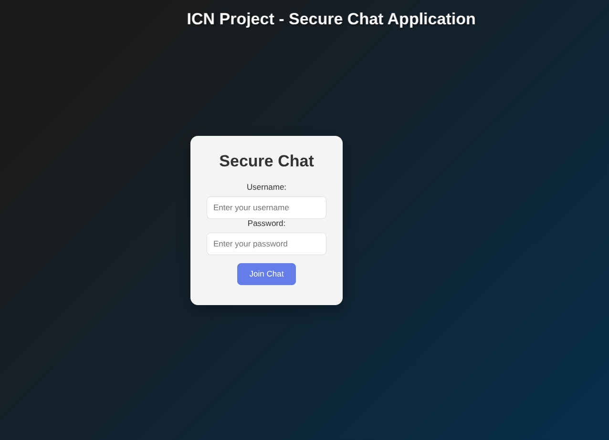
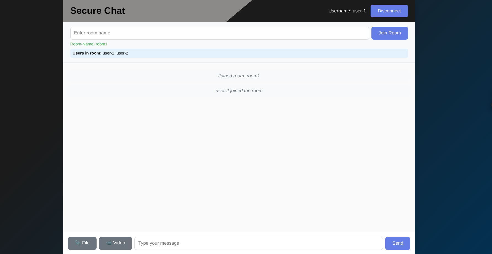
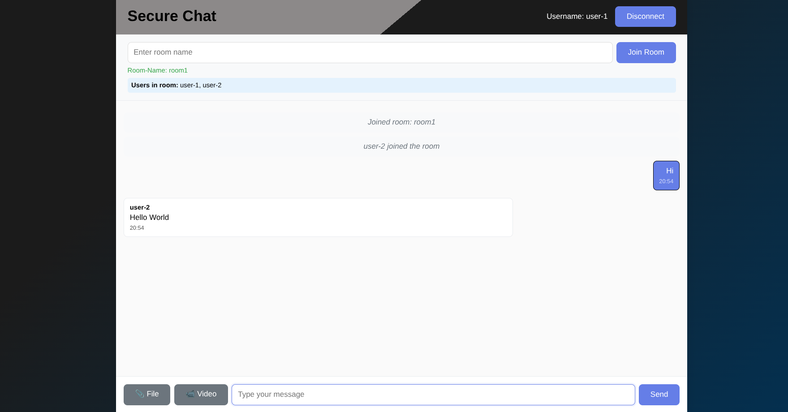
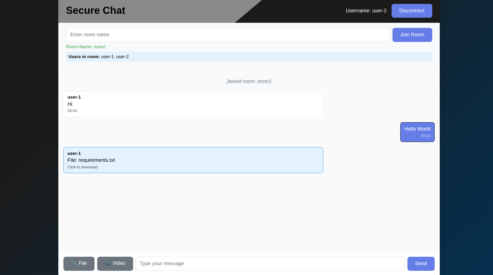

# Secure Chat App

A secure, real-time chat application built with Python Flask-SocketIO, HTML, CSS, and JavaScript. Now supports file sharing, planned real-time video, AES encryption, and ESP clients.

---

## Features

-  **Secure Communication:** Real-time WebSocket chat
-  **Room-based Chat:** Join and switch between chat rooms
-  **File Sharing:** Upload/download files (up to 10MB)
-  **Real-time Video (Planned):** Video streaming between users *(coming soon)*
-  **AES Encryption (Planned):** End-to-end encrypted messages and files *(coming soon)*
-  **ESP Client Support:** ESP devices can join as chat/file transfer clients *(coming soon)*
-  **Multi-user Support:** Multiple users per room
-  **Modern UI:** Responsive, animated interface

---

## Quick Start

### Option 1: Automated Setup (Recommended)
```bash
chmod +x setup.sh
./setup.sh
```

### Option 2: Manual Setup
```bash
python3 -m venv venv
source venv/bin/activate
pip install -r requirements.txt
```

### Running the Application
```bash
# Option 1: Using run script (Recommended)
chmod +x run_app.sh
./run_app.sh

# Option 2: Manual run
source venv/bin/activate
python server.py
```

Open your browser at `http://localhost:4000` (or your server IP).

---

## File Structure

```
secure-chat-app/
├── server.py              # Flask-SocketIO server
├── requirements.txt       # Python dependencies
├── setup.sh               # Setup script
├── run_app.sh             # Run script
├── README.md              # This file
├── static/
│   ├── style.css          # CSS styling
│   ├── script.js          # Client-side JS
│   └── socket.io.js       # Socket.IO client (local)
├── templates/
│   └── index.html         # Main HTML template
├── cert.pem, key.pem      # SSL certificates
└── venv/                  # Python virtual environment (not tracked by git)
```

---

## How to Use

### Joining a Chat
- Enter your username on the login screen
- Click "Join Chat" to connect

### Joining a Room
- Enter a room name
- Click "Join Room"
- See the list of users in the room

### Chatting
- Type messages and send in real-time

### File Sharing
- Click 📎 File to upload (max 10MB)
- Progress bar shows upload status
- Others can download shared files

### Real-time Video *(Planned)*
- Click 🎥 Video to start a video stream (feature coming soon)

### AES Encryption *(Planned)*
- All messages and files will be encrypted with AES for privacy (feature coming soon)

### ESP Client Support
- ESP devices can connect as clients for chat and file transfer (feature coming soon)

---

## Technical Details

- **Backend:** Python Flask + Flask-SocketIO
- **Frontend:** Vanilla JS + HTML5 + CSS3
- **Communication:** WebSocket via Socket.IO
- **File Transfer:** Chunked, base64-encoded
- **Security:**  AES encryption
- **ESP Integration:** Custom protocol for ESP clients

---

## Customization

- **Colors:** Edit `static/style.css`
- **File size limit:** Change in `static/script.js`
- **Port:** Change in `server.py`
- **Add features:** Extend `server.py` and `script.js`

---

## Screenshots

### Login Screen


### Room Management


### Chat Interface


### File Transfer

---

## Browser Compatibility

- Chrome, Firefox, Safari, Edge (recent versions)

---

## Troubleshooting

- **Connection Issues:** Check firewall, port, and browser console
- **File Upload Issues:** Ensure file <10MB, check browser console
- **Socket.IO Issues:** Use local `socket.io.js` for offline/CDN-restricted networks

---

## License

MIT License

